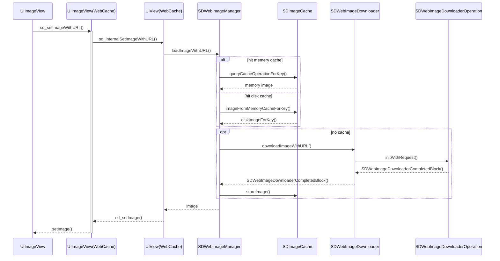

<meta name="referrer" content="no-referrer" />
<!-- toc -->

## SDWebImage 时序图：

整理了一下 SDWebImage 的时序图：

从时序图可以看到，SDWebImage 的核心逻辑，其实也特别简单:

1、入口是调用 UIImageView 的 `sd_setImageWithURL`，
这个方法是 UIImageView 的 Category (WebCache) 提供；
2、然后调用到 UIView 的 Category 里，原因是不止给 UIImageView 提供扩展，还有 UIButton 等；
3、再调用到 SDWebImageManager 这个单例里，manager 再调用 SDImageCache 单例去内存查找缓存，没有找到再去 磁盘查找缓存；
4、如果都没有，manager 调用 SDWebImageDownloader 这个单例，创建一个 SDWebImageDownloaderOperation 这个 NSOperation 的子类，去开启下载任务；
- SDWebImageDownloader 里用一个 dict 缓存了所有开启的下载 Operation，避免重复创建下载动作；
- 并持有 NSOperationQueue 用于启动 operation
5、如果 operation 下载成功，会将数据通过 block 回调给 SDWebImageDownloader，再传给 SDWebImageManager，manager 会先讲数据返回给 UIImageView 界面；然后，调用 SDImageCache 去缓存数据到内存和磁盘

时序图的 markdown 源码如下:

## SDWebImage 源码思维导图

这个思维导图来自 @雷纯锋 的一篇源码解析，整理得非常细致，推荐：

## 源码解析

SDWebImage 源码分析的文章网上已经很多了，[iOS SDWebImage 源码分析及架构设计探索](https://www.jianshu.com/p/e95baecb36b6) 这篇里的几幅配图都很不错，推荐。
