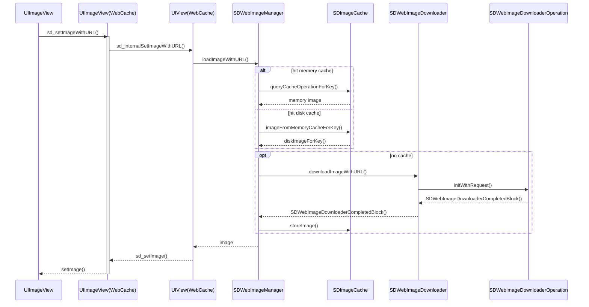

## 整理了一下 SDWebImage 的时序图：

markdown 源码如下:

## 源码思维导图

这个思维导图来自 @雷纯锋 的一篇源码解析，整理得非常细致，推荐：

## 源码解析

SDWebImage 源码分析的文章网上已经很多了，[iOS SDWebImage 源码分析及架构设计探索](https://www.jianshu.com/p/e95baecb36b6) 这篇里的几幅配图都很不错，推荐。
